## Steps to deploy a node application into Kubernetes EKS ##

#### References ####
* https://www.youtube.com/watch?v=_jEgzqyUWKE
* https://github.com/antonputra/tutorials/tree/main/lessons/046

#### Prerequisites ####
* Install `aws` command line utility
* Install `eksctl` command line utility
* Generate access key and secret from https://console.aws.amazon.com/iam/home#/security_credentials$mfa
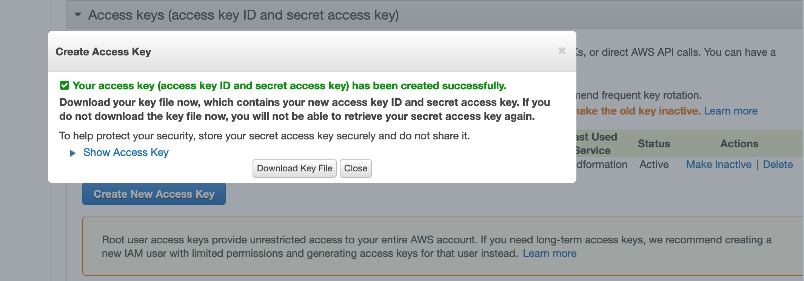
* Connect to aws using the command `aws configure`. Use the above generated `AWS Access Key ID and AWS Access Secret`.
* Verify eksctl installation using the command `eksctl version`
* Verify aws configuration using the command `aws iam get-user`

#### Create sample node app ####
* Create a project directory `mkdir ~/node-kubernetes-eks-deploy`
* Switch to project direcoty `cd ~/node-kubernetes-eks-deploy`
* Create directory `mkdir app`
* Create a simple `express` app 
* Sample `server.js` file (or `index.js`)
```js
const express=require('express');

const port=8080
const app=express();

app.get('/',(req,res)=>{
    res.send('Hello!! root is running')
})

app.get('/devops',(req,res)=>{
    res.send('Hello!! devops is running')
})

app.listen(port,()=>{
    console.log(`App listening at port:${port}`)
})
```
* Create a docker file named `Dockerfile` inside the folder `app`
```js
FROM node:15.8.0

WORKDIR /usr/src/app

COPY ./package*.json ./

RUN npm ci --only=production

COPY . .

USER node

CMD ["node" "server.js"]
```
* Create a docker ignore file named `.dockerignore` with following contents
```
node_modules
npm-debug.log
```
* Now build docker image `docker build -t testkubernets:v1.0.0 -f Dockerfile .`
* Verify by running `docker images`
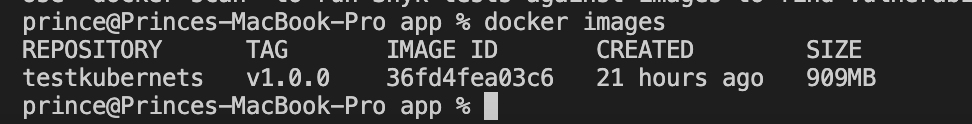


#### Push docker images into eks repository in AWS ####
* Open aws console `https://ap-south-1.console.aws.amazon.com/ecr/repositories` and click on `Create Repository`
* Choose `Visibility settings` as private
* Give any name, say `testkubernets`
* Leave other fields with default values
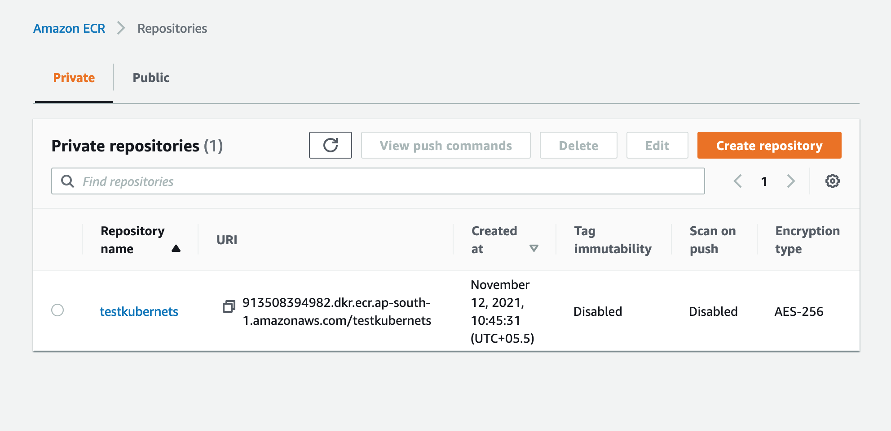
* Now select the repository `aws-repository-list` and click `View Push Commands` button. Now you could see commands to push docker images into repository.
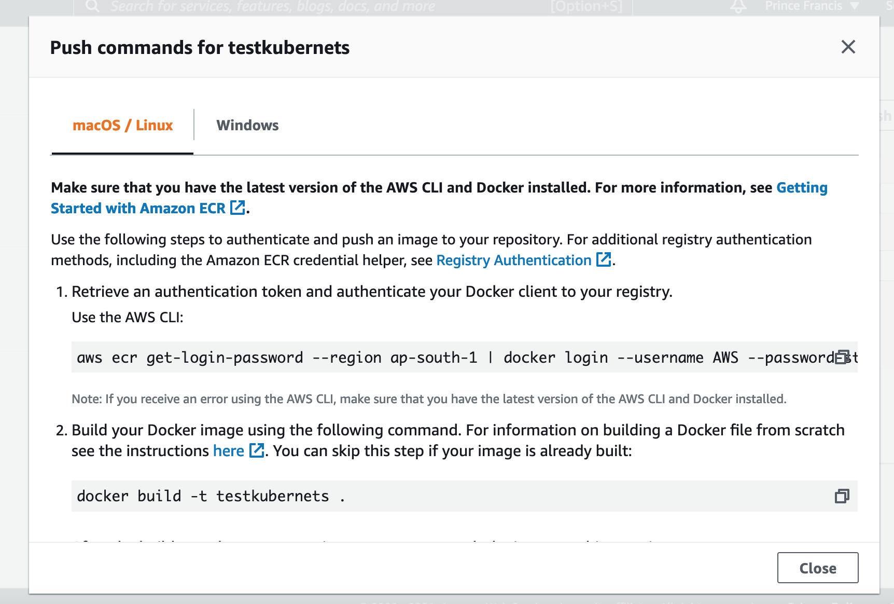
* Login using the login command from the above command list.
* Now tag the docker image created above. Use the command from the above list. Change the version name if requried. (default version name is `latest`)
eg : `docker tag testkubernets:v1.0.0 913508394982.dkr.ecr.ap-south-1.amazonaws.com/testkubernets:v1.0.0`
* Verify it by running `docker images`
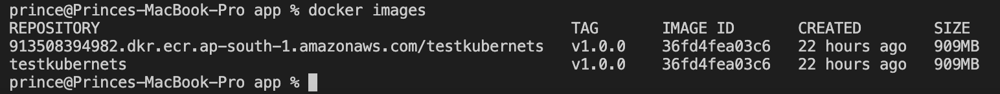
* Now push the docker images into repository using the docker push command in the above command list.
`docker push 913508394982.dkr.ecr.ap-south-1.amazonaws.com/testkubernets:v1.0.0`
* Wait for a few minutes to complete the command execution.


#### Create EKS Cluster (Default VPC will be created)####
* Create a yaml script in project root directory named `eks.yaml` with following contents.
* `cd ..`
* Change the aws region in the yaml script
```yaml
---
apiVersion: eksctl.io/v1alpha5
kind: ClusterConfig
metadata:
  name: testkubernets
  region: ap-south-1
availabilityZones: 
- ap-south-1a
- ap-south-1b
managedNodeGroups:
- name: on-demand
  labels:
    role: on-demand
  instanceType: t2.small
  desiredCapacity: 1
  volumeSize: 20
```
* Create the cluster using the command `eksctl create cluster -f eks.yaml`
* At any point of time, if you would like to delete the cluster, use the command `eksctl delete cluster -f eks.yaml`
* Wait for a few minutes to complete the cluster creation process.

#### Create EKS Cluster - With custom VPC ####
* Create a VPC (Stack in CloudFormation) -> `https://console.aws.amazon.com/cloudformation/home?region=ap-south-1#/stacks/create/template`
* Use the template file `vpc/amazon-eks-vpc-private-subnets.yaml`
* Change CIRD if needed -> `By default it was 192.168 series, I changed to 10.30`
* Update the vpc id and subnet ids in `eks2.yaml`
* Create the cluster using the command `eksctl create cluster -f eks.yaml`

#### Deploy node app into Kubernetes ####
* Create a folder `k8s` in project root folder
* Create a yaml script named `1-testkubernetes.yaml`
```yaml
---
apiVersion: v1
kind: Namespace
metadata:
  name: production
---
apiVersion: apps/v1
kind: Deployment
metadata:
  name: testkubernetes
  namespace: production
  labels:
    app: testkubernetes
spec:
  replicas: 2
  selector:
    matchLabels:
      app: testkubernetes
  template:
    metadata:
      labels:
        app: testkubernetes
    spec:
      containers:
      - name: testkubernetes
        image: 913508394982.dkr.ecr.ap-south-1.amazonaws.com/testkubernets:v1.0.0
        ports:
        - name: http
          containerPort: 8080
        resources:
          requests: {}
---
apiVersion: v1
kind: Service
metadata:
  name: testkubernetes
  namespace: production
spec:
  selector:
    app: testkubernetes
  ports:
  - protocol: TCP
    port: 8080
```
* Apply the above yaml script using the command `kubectl apply -f k8s/1-testkubernetes.yaml`
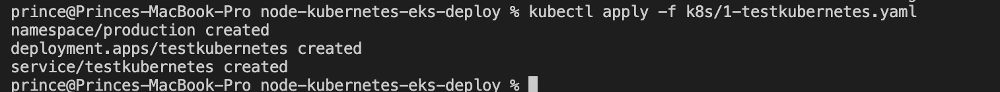
* Verify it by listing the pods `kubectl get pods -n production`
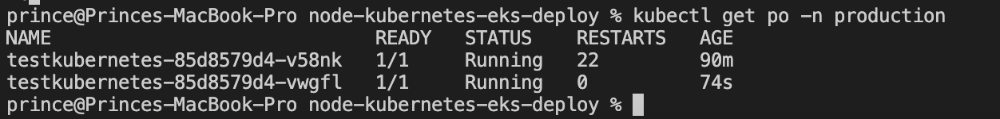
* List services using the command `kubectl get svc -n production`
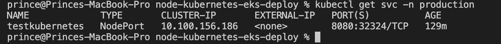
* Forward local 8080 port to kubernetes `kubectl -n production port-forward svc/testkubernetes 8080:8080`
* Now open localhost:8080 in browser and verify it. Then CNTRL+C to stop port forwarding.

#### Deploy nginx ingress controller into Kubernetes ####
* Create a yaml script `k8s/2-nginx-ingress.yaml`
```yaml
---
apiVersion: v1
kind: Namespace
metadata:
  name: ingress-nginx
---
apiVersion: v1
kind: ServiceAccount
metadata:
  name: ingress-nginx
  namespace: ingress-nginx
---
apiVersion: v1
kind: ConfigMap
metadata:
  name: ingress-nginx-controller
  namespace: ingress-nginx
data:
---
apiVersion: rbac.authorization.k8s.io/v1
kind: ClusterRole
metadata:
  name: ingress-nginx
rules:
  - apiGroups:
      - ''
    resources:
      - configmaps
      - endpoints
      - nodes
      - pods
      - secrets
    verbs:
      - list
      - watch
  - apiGroups:
      - ''
    resources:
      - nodes
    verbs:
      - get
  - apiGroups:
      - ''
    resources:
      - services
    verbs:
      - get
      - list
      - watch
  - apiGroups:
      - extensions
      - networking.k8s.io
    resources:
      - ingresses
    verbs:
      - get
      - list
      - watch
  - apiGroups:
      - ''
    resources:
      - events
    verbs:
      - create
      - patch
  - apiGroups:
      - extensions
      - networking.k8s.io
    resources:
      - ingresses/status
    verbs:
      - update
  - apiGroups:
      - networking.k8s.io
    resources:
      - ingressclasses
    verbs:
      - get
      - list
      - watch
---
apiVersion: rbac.authorization.k8s.io/v1
kind: ClusterRoleBinding
metadata:
  name: ingress-nginx
roleRef:
  apiGroup: rbac.authorization.k8s.io
  kind: ClusterRole
  name: ingress-nginx
subjects:
  - kind: ServiceAccount
    name: ingress-nginx
    namespace: ingress-nginx
---
apiVersion: rbac.authorization.k8s.io/v1
kind: Role
metadata:
  name: ingress-nginx
  namespace: ingress-nginx
rules:
  - apiGroups:
      - ''
    resources:
      - namespaces
    verbs:
      - get
  - apiGroups:
      - ''
    resources:
      - configmaps
      - pods
      - secrets
      - endpoints
    verbs:
      - get
      - list
      - watch
  - apiGroups:
      - ''
    resources:
      - services
    verbs:
      - get
      - list
      - watch
  - apiGroups:
      - extensions
      - networking.k8s.io
    resources:
      - ingresses
    verbs:
      - get
      - list
      - watch
  - apiGroups:
      - extensions
      - networking.k8s.io
    resources:
      - ingresses/status
    verbs:
      - update
  - apiGroups:
      - networking.k8s.io
    resources:
      - ingressclasses
    verbs:
      - get
      - list
      - watch
  - apiGroups:
      - ''
    resources:
      - configmaps
    resourceNames:
      - ingress-controller-leader-nginx
    verbs:
      - get
      - update
  - apiGroups:
      - ''
    resources:
      - configmaps
    verbs:
      - create
  - apiGroups:
      - ''
    resources:
      - events
    verbs:
      - create
      - patch
---
apiVersion: rbac.authorization.k8s.io/v1
kind: RoleBinding
metadata:
  name: ingress-nginx
  namespace: ingress-nginx
roleRef:
  apiGroup: rbac.authorization.k8s.io
  kind: Role
  name: ingress-nginx
subjects:
  - kind: ServiceAccount
    name: ingress-nginx
    namespace: ingress-nginx
---
apiVersion: v1
kind: Service
metadata:
  name: ingress-nginx-controller
  namespace: ingress-nginx
  labels:
    app.kubernetes.io/name: ingress-nginx
  annotations:
    service.beta.kubernetes.io/aws-load-balancer-backend-protocol: tcp
    service.beta.kubernetes.io/aws-load-balancer-cross-zone-load-balancing-enabled: 'true'
    service.beta.kubernetes.io/aws-load-balancer-type: nlb
spec:
  type: LoadBalancer
  externalTrafficPolicy: Local
  ports:
    - name: http
      port: 80
      protocol: TCP
      targetPort: http
    - name: https
      port: 443
      protocol: TCP
      targetPort: https
  selector:
    app.kubernetes.io/name: ingress-nginx
---
apiVersion: apps/v1
kind: Deployment
metadata:
  labels:
    app.kubernetes.io/name: ingress-nginx
  name: ingress-nginx-controller
  namespace: ingress-nginx
spec:
  selector:
    matchLabels:
      app.kubernetes.io/name: ingress-nginx
  revisionHistoryLimit: 10
  minReadySeconds: 0
  template:
    metadata:
      labels:
        app.kubernetes.io/name: ingress-nginx
    spec:
      dnsPolicy: ClusterFirst
      containers:
        - name: controller
          image: k8s.gcr.io/ingress-nginx/controller:v0.44.0@sha256:3dd0fac48073beaca2d67a78c746c7593f9c575168a17139a9955a82c63c4b9a
          imagePullPolicy: IfNotPresent
          lifecycle:
            preStop:
              exec:
                command:
                  - /wait-shutdown
          args:
            - /nginx-ingress-controller
            - --publish-service=$(POD_NAMESPACE)/ingress-nginx-controller
            - --election-id=ingress-controller-leader
            - --ingress-class=nginx
            - --configmap=$(POD_NAMESPACE)/ingress-nginx-controller
          securityContext:
            capabilities:
              drop:
                - ALL
              add:
                - NET_BIND_SERVICE
            runAsUser: 101
            allowPrivilegeEscalation: true
          env:
            - name: POD_NAME
              valueFrom:
                fieldRef:
                  fieldPath: metadata.name
            - name: POD_NAMESPACE
              valueFrom:
                fieldRef:
                  fieldPath: metadata.namespace
            - name: LD_PRELOAD
              value: /usr/local/lib/libmimalloc.so
          livenessProbe:
            httpGet:
              path: /healthz
              port: 10254
              scheme: HTTP
            initialDelaySeconds: 10
            periodSeconds: 10
            timeoutSeconds: 1
            successThreshold: 1
            failureThreshold: 5
          readinessProbe:
            httpGet:
              path: /healthz
              port: 10254
              scheme: HTTP
            initialDelaySeconds: 10
            periodSeconds: 10
            timeoutSeconds: 1
            successThreshold: 1
            failureThreshold: 3
          ports:
            - name: http
              containerPort: 80
              protocol: TCP
            - name: https
              containerPort: 443
              protocol: TCP
          resources:
            requests:
              cpu: 100m
              memory: 90Mi
      nodeSelector:
        kubernetes.io/os: linux
      serviceAccountName: ingress-nginx
      terminationGracePeriodSeconds: 300
```
* Deploy it using the command `kubectl apply -f k8s/2-nginx-ingress.yaml`
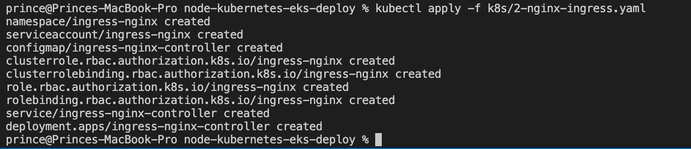
* List the pods `kubectl get pods -n ingress-nginx`
* List the services `kubectl get svc -n ingress-nginx`
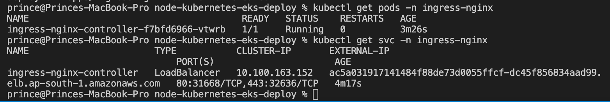

#### Create ingress for NodeJs ####
* Create a yaml script `k8s/3-http-ingress.yaml`
```yaml
---
apiVersion: networking.k8s.io/v1beta1
kind: Ingress
metadata:
  name: http-testkubernetes
  namespace: production
  annotations:
    kubernetes.io/ingress.class: nginx
spec:
  rules:
  - host: testkubernetes.5by1.com
    http:
      paths:
      - path: /
        backend:
          serviceName: testkubernetes
          servicePort: 8080
```
* Deploy it using the command `kubectl apply -f k8s/3-http-ingress.yaml`
* Verify it `kubectl get ing -n production`
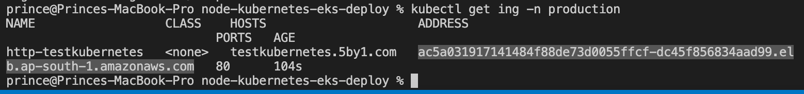
* Copy the address and issue command `nslookup <address copied>`
* Verify it using the command `curl --resolve testkubernetes.5by1.com:80:<ip address from above command> http://testkubernetes.5by1.com/devops`

#### Create https ingress for NodeJs ####
* If you have ssl certificates, you could configure ingress for https protocol.
* Delete current secrets in the namespace if any, by using the command `kubectl delete secret tls tls-secret --namespace=production`. Where `tls-secret` is the name. We can give any name.
* Create secret using the command `kubectl create secret tls tls-secret --namespace=production --key <path to private key> --cert <path to certificate file (bundle.crt)>`
* Now change the `3-http-ingress.yaml` as follows
```yaml
---
apiVersion: networking.k8s.io/v1beta1
kind: Ingress
metadata:
  name: http-testkubernetes
  namespace: production
  annotations:
    kubernetes.io/ingress.class: nginx
    nginx.ingress.kubernetes.io/ssl-redirect: "true"
    nginx.ingress.kubernetes.io/rewrite-target: /
  labels:
    app: http-testkubernetes
spec:
  tls:
  - hosts:
    - testkubernetes.5by1.com
    secretName: tls-secret
  rules:
  - host: testkubernetes.5by1.com
    http:
      paths:
      - path: /
        backend:
          serviceName: testkubernetes
          servicePort: 8080
```
* Deploy it into kubernetes using the command `kubectl apply -f k8s/3-http-ingress.yaml`
* Find host name using `kubectl get ing -n production`
* Find ip address using `nslookup ac5a031917141484f88de73d0055ffcf-dc45f856834aad99.elb.ap-south-1.amazonaws.com`
* Verify it using `curl --resolve testkubernetes.5by1.com:443:15.206.13.238 https://testkubernetes.5by1.com/devops`

#### Debug ####
* List pods `kubectl get pods -n production`
* List services `kubectl get svc -n production`
* Check if any error in pods `kubectl logs -n{namespace} pod/{pod_name}`
* To get terminal of a pod `kubectl exec -it -n production {pod_name} -- bash`

#### To change the cluster ####
* `aws eks update-kubeconfig --name <clustername> --region <region>`
